# Kiến trúc Microservice — AI Tutor

---

## 1. Hiện trạng: Kiến trúc Microservice Toàn Diện

Hệ thống đã hoàn tất chuyển đổi từ Monolith sang Microservices theo **Strangler Fig Pattern**. Khối Monolith cũ giờ đây đóng vai trò hoàn toàn là một **API Gateway**, điều phối traffic đến 4 Service độc lập.

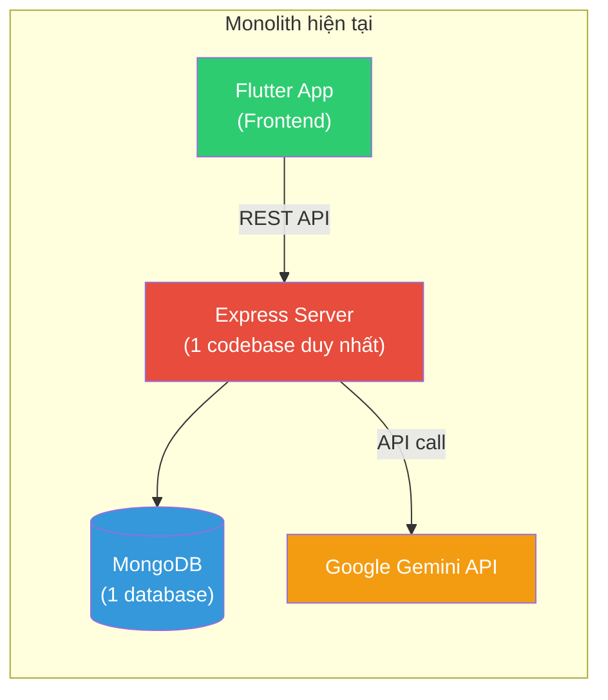

### Vấn đề của Monolith

| Vấn đề | Mô tả |
|---------|--------|
| **Coupling cao** | Auth, Learning, AI, Quiz đều chung 1 codebase |
| **Khó scale** | Muốn scale AI chat phải scale cả auth, lesson |
| **Single point of failure** | Server chết → toàn bộ app chết |
| **Khó phân chia team** | Tất cả dev sửa cùng 1 repo |

---

## 2. Kiến trúc Microservice đề xuất

### 2.1 Tổng quan 4 Services

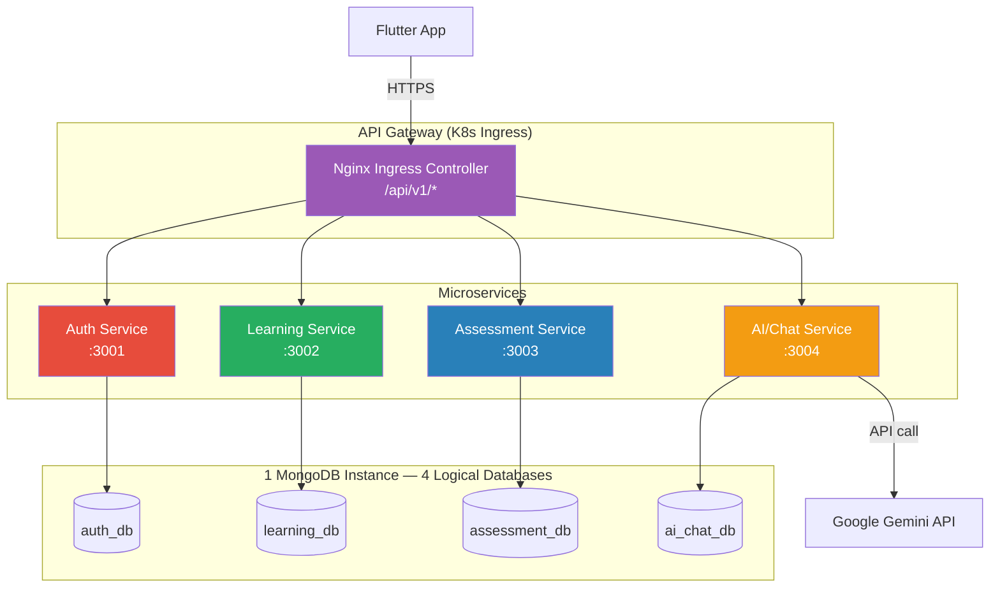

### 2.2 Chi tiết từng Service

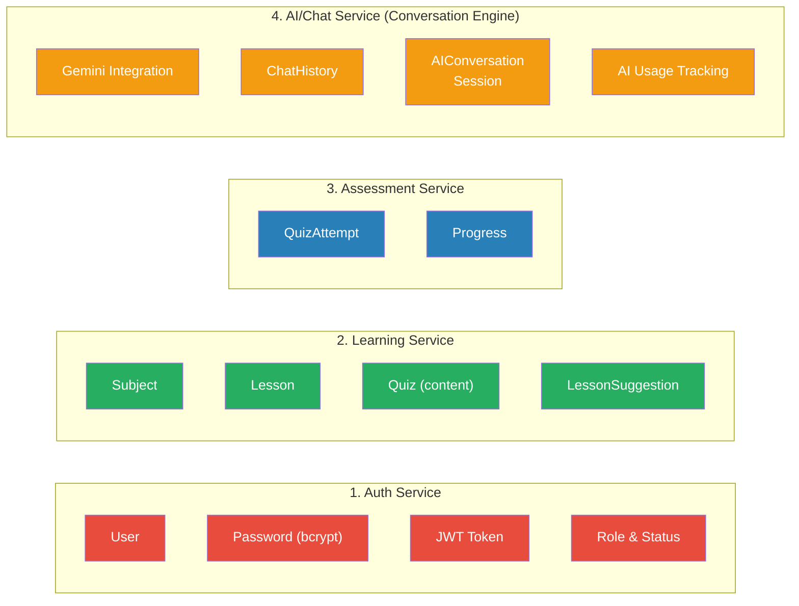

### 2.3 Service Responsibilities

Bảng tóm tắt trách nhiệm cốt lõi của từng Microservice để đảm bảo tính độc lập:

| Service | Trách nhiệm (Responsibility) | Domain Data Sở hữu |
|---------|-----------------------------|---------------------|
| **Auth** | Quản lý User, đăng nhập, Sign JWT | User profiles, Credentials |
| **Learning** | Cung cấp Subject, Lesson, Quiz content | Subjects, Lessons, Quizzes |
| **Assessment** | Lưu Progress, chấm điểm Quiz | Progress, Quiz Attempts |
| **AI Chat** | Lâu trữ hội thoại, giao tiếp Gemini | Chat Histories, AI Sessions |

### 2.4 API Contracts

Gateway định tuyến các request từ Frontend vào các service tương ứng dựa trên prefix:

```yaml
# Public API Routes (Frontend gọi)
/api/v1/users/login      👉 Auth Service
/api/v1/users/register   👉 Auth Service

/api/v1/subjects/*       👉 Learning Service
/api/v1/lessons/*        👉 Learning Service
/api/v1/quizzes/*        👉 Learning Service
/api/v1/lesson-suggestions 👉 Learning Service

/api/v1/progress/*       👉 Assessment Service
/api/v1/attempts/*       👉 Assessment Service

/api/v1/ai/messages      👉 AI Chat Service
/api/v1/ai/conversations 👉 AI Chat Service

# Internal API Routes (Service-to-Service gọi)
/internal/verify         👉 Auth Service
/internal/quizzes/:id    👉 Learning Service
/internal/lessons/:id    👉 Learning Service
```

---

## 3. Ownership & Boundary Rules

Mỗi service **chỉ đọc/ghi database của riêng mình**. Khi cần dữ liệu từ service khác → gọi qua REST API.

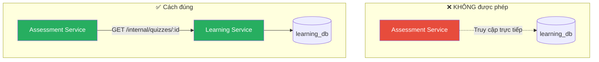

| Service | Sở hữu | Không được chứa |
|---------|---------|-----------------|
| **Auth** | User, Password, JWT | Lesson, Quiz, Chat data |
| **Learning** | Subject, Lesson, Quiz content, Suggestion | QuizAttempt, Progress |
| **Assessment** | QuizAttempt, Progress | Subject/Lesson content gốc |
| **AI/Chat** | ChatHistory, Session, AI Usage | User password, Lesson content |

---

## 4. Luồng xử lý chính (Sequence Diagrams)

### 4.1 Đăng nhập

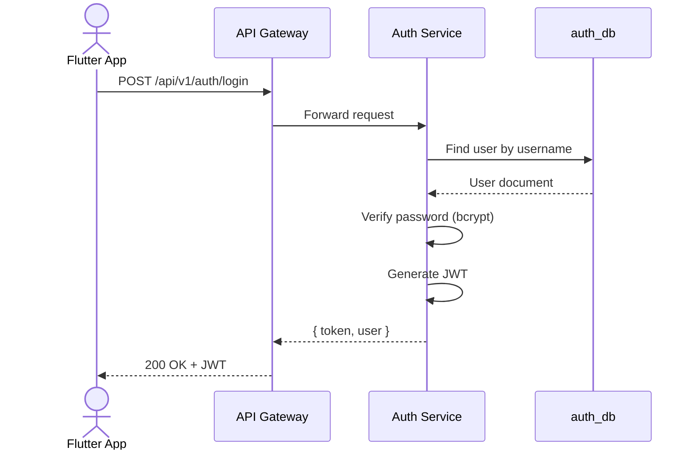

### 4.2 Xem bài học & theo dõi tiến độ

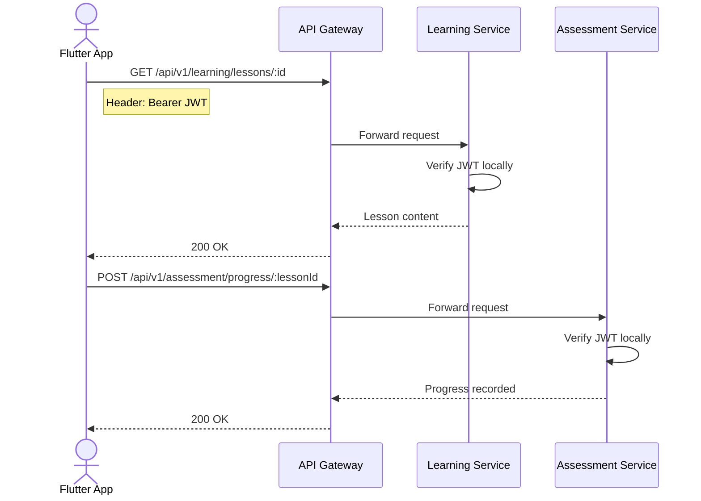

### 4.3 Làm quiz & cập nhật điểm

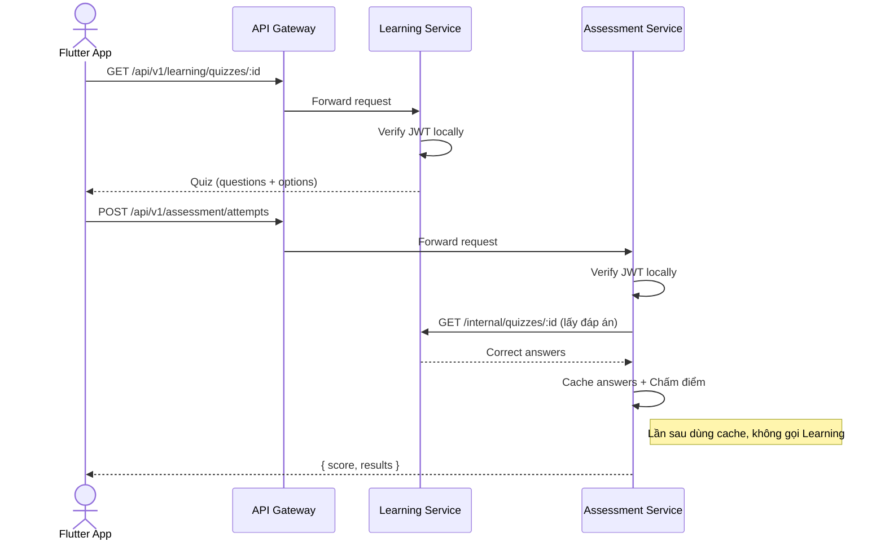

### 4.4 Chat với AI

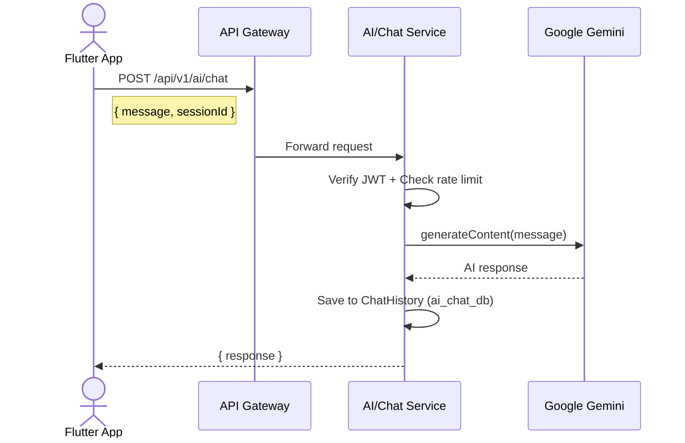

---

## 5. Giao tiếp giữa các Service

### 5.1 Phương thức: REST Synchronous

Các service giao tiếp nội bộ qua **internal API** (prefix `/internal/`), tách biệt với public API (`/api/v1/`).

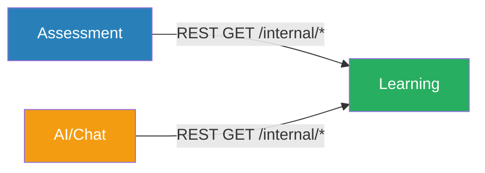

> **Lưu ý:** AI/Chat **không gọi** Assessment. AI chỉ cần content (Subject, Lesson, Quiz) từ Learning Service → giảm coupling tối đa.

| Caller | Callee | API | Mục đích |
|--------|--------|-----|----------|
| Assessment | Learning | `GET /internal/quizzes/:id` | Lấy đáp án quiz để chấm |
| AI/Chat | Learning | `GET /internal/lessons/:id` | Context cho AI tạo quiz |
| AI/Chat | Learning | `GET /internal/subjects` | Danh sách môn học |

**Public vs Internal API:**

| Loại | Prefix | Ai gọi | Versioned |
|------|--------|--------|-----------|
| Public | `/api/v1/*` | Flutter App (qua Gateway) | ✅ Có |
| Internal | `/internal/*` | Service-to-service (trong cluster) | ❌ Không |

### 5.2 Resilience: Chain Latency & Failure Handling

REST synchronous có rủi ro **chain failure** — nếu Learning Service down, Assessment không chấm được quiz.

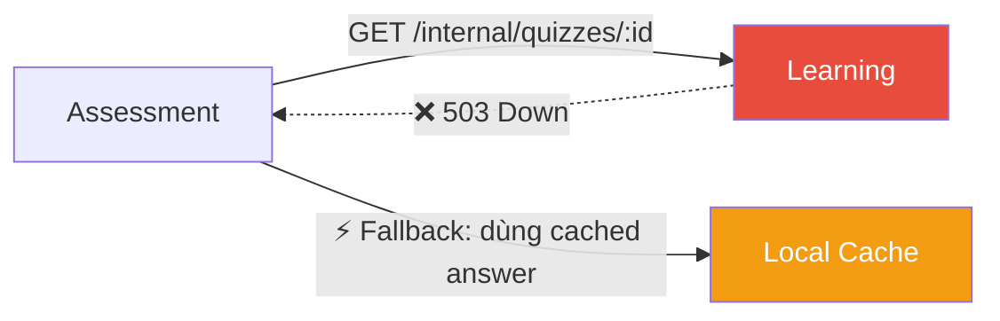

| Giải pháp | Mô tả | Áp dụng |
|-----------|-------|---------|
| **Timeout + Retry** | Giới hạn 3s, retry 1 lần | Giai đoạn 1 |
| **Cache đáp án quiz** | Assessment cache quiz answers khi lấy lần đầu | Giai đoạn 1 |
| **Circuit Breaker** | Ngắt gọi nếu service liên tục fail | Nâng cao (sau) |
| **Event-driven (Kafka)** | Loại bỏ sync dependency hoàn toàn | Enterprise (không cần cho đồ án) |

### 5.2 JWT Verification

Tất cả service **share cùng 1 JWT_SECRET** qua K8s Secret. Mỗi service tự verify JWT mà không cần gọi Auth Service.

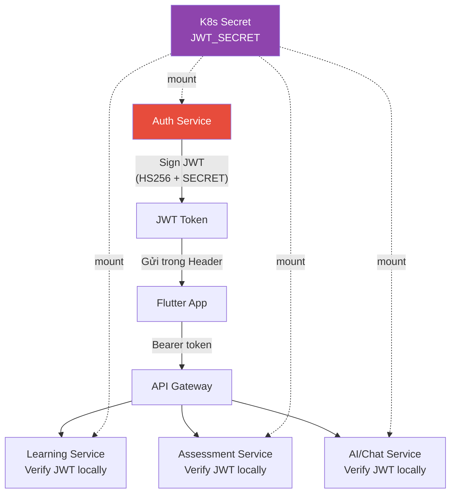

---

## 6. Database Schema (tách theo service)

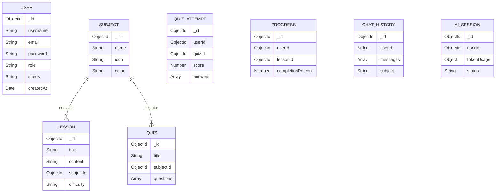

> **Lưu ý:** `userId`, `quizId`, `lessonId` trong Assessment và AI/Chat DB là **ID tham chiếu** (reference), không phải foreign key join. Khi cần thông tin chi tiết → gọi REST API sang service tương ứng.

---

## 6.1 Database Deployment Strategy

Sử dụng **1 MongoDB instance, 4 logical databases** — tách biệt ở tầng logic, không tách vật lý.

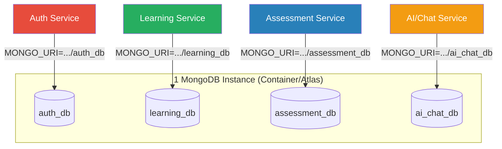

| Môi trường | Chiến lược | Lý do |
|------------|------------|-------|
| **Development** | 1 Mongo container, 4 databases | Đơn giản, tiết kiệm resource |
| **Production** | 1 Mongo instance (hoặc Atlas), 4 databases | Đủ cho scale đồ án |
| **Enterprise** | 4 Mongo instances riêng biệt | Cần khi data >100GB/service |

> **Quyết định:** Tách **logical** (database name), không tách **physical** (instance). Mỗi service chỉ biết connection string của DB mình qua `MONGO_URI` env variable → ownership vẫn được đảm bảo.

---

## 7. Triển khai trên Kubernetes

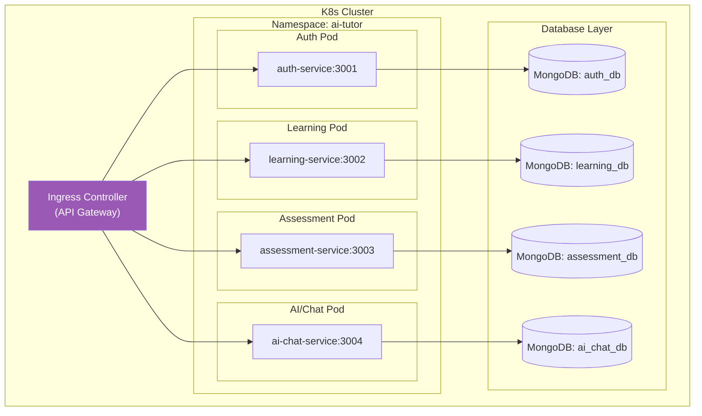

### Ingress Routing Rules

```yaml
# Ví dụ K8s Ingress config
rules:
  - path: /api/v1/auth     → auth-service:3001
  - path: /api/v1/learning  → learning-service:3002
  - path: /api/v1/assessment → assessment-service:3003
  - path: /api/v1/ai        → ai-chat-service:3004
```

Mỗi service có:
- **Deployment** riêng (có thể scale replicas độc lập)
- **Service** (ClusterIP) riêng
- **Health check**: `/health` (liveness) + `/ready` (readiness)
- **ConfigMap/Secret** riêng cho env variables

### Gateway Enhancement Roadmap

Hiện tại dùng **K8s Ingress** làm gateway — chỉ routing, **không verify JWT**. Mỗi service tự verify JWT locally. Security boundary vẫn được đảm bảo vì mỗi service verify JWT independently.

| Tính năng | Công cụ | Mức độ |
|-----------|---------|--------|
| Rate Limiting (Gateway) | Nginx `limit_req` hoặc Kong | Nên có |
| **Rate Limiting (AI Service)** | **Per-userId limit, max concurrent requests** | **Quan trọng** |
| Auth at Gateway | Verify JWT tại Ingress (lua script) | Tùy chọn (hiện service tự verify) |
| Centralized Logging | Fluentd + ELK | Nâng cao |
| API Versioning | Path-based `/api/v1`, `/api/v2` | Đã hỗ trợ |
| Block `/internal/*` từ bên ngoài | Ingress chỉ route `/api/v1/*` | Bắt buộc |

---

## 8. So sánh Monolith vs Microservice

| Tiêu chí | Monolith (hiện tại) | Microservice (đề xuất) |
|----------|---------------------|------------------------|
| Codebase | 1 repo, 1 server.js | 1 mono-repo, 4 service folders, 4 entry points |
| Database | 1 MongoDB | 4 MongoDB databases |
| Scaling | Scale cả khối | Scale từng service |
| Deploy | 1 lần deploy all | Deploy độc lập |
| Fault isolation | 1 lỗi → sập hết | 1 service lỗi → còn lại hoạt động |
| Complexity | Thấp | Cao hơn (networking, deploy) |
| Phù hợp | MVP, prototype | Production, enterprise |

---

## 9. Hành trình chuyển đổi (Phasing - ĐÃ HOÀN TẤT)

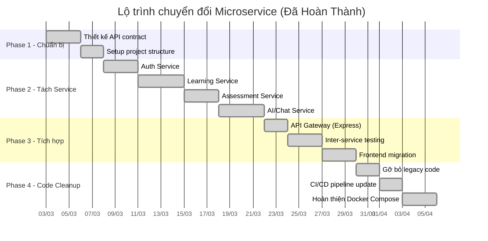

---

## 10. Rủi ro & Giải pháp

| Rủi ro | Giải pháp |
|--------|-----------|
| Network latency giữa services | Giữ REST call tối thiểu, cache data khi cần |
| Chain failure (service B down → A fail) | Timeout 3s + retry + local cache |
| Data consistency | Eventual consistency chấp nhận được ở mức đồ án |
| Quản lý nhiều DB | 1 Mongo instance, 4 logical databases |
| Debug phức tạp hơn | Request ID truyền qua tất cả services (correlation) |
| Deploy phức tạp | CI/CD pipeline tự động cho mỗi service |

---

## 11. Quyết định kiến trúc (Architecture Decision Records)

| # | Quyết định | Lý do |
|---|-----------|-------|
| ADR-1 | 4 logical databases, 1 physical MongoDB instance | Đủ ownership isolation, tránh overkill 4 containers |
| ADR-2 | AI/Chat = **Conversation Engine** (có DB riêng) | AI cần lưu ChatHistory, Session, Token Usage → cần persistent storage |
| ADR-3 | REST synchronous (không Kafka) | Đơn giản, đủ cho đồ án, dễ debug |
| ADR-4 | K8s Ingress làm API Gateway (chỉ routing) | Tận dụng infra hiện có, JWT verify ở từng service |
| ADR-5 | HS256 JWT + K8s Secret | Đơn giản, phù hợp mức đồ án |
| ADR-6 | Public `/api/v1/*` vs Internal `/internal/*` | Tránh version conflict, block internal từ bên ngoài |
| ADR-7 | AI chỉ gọi Learning (không gọi Assessment) | Giảm coupling, AI chỉ cần content không cần user behavior |
| ADR-8 | **Mono-repo** (không multi-repo) | 1 dev, shared code dễ quản lý, CI/CD đơn giản |
| ADR-9 | npm local dependency cho shared code | Không hack runtime như `module-alias`, npm native symlink |

---

## 12. Mono-repo Project Structure

```
AI-Tutor/
│
├── services/                    # 4 Microservices
│   ├── auth/                    # Auth Service (:3001)
│   │   ├── src/
│   │   │   ├── auth.controller.js
│   │   │   ├── auth.service.js
│   │   │   ├── auth.routes.js
│   │   │   └── user.model.js
│   │   ├── server.js
│   │   ├── package.json
│   │   └── Dockerfile
│   │
│   ├── learning/                # Learning Service (:3002)
│   │   ├── src/
│   │   │   ├── lesson.controller.js
│   │   │   ├── subject.controller.js
│   │   │   ├── quiz.controller.js
│   │   │   ├── learning.service.js
│   │   │   ├── lesson.model.js
│   │   │   ├── subject.model.js
│   │   │   └── quiz.model.js
│   │   ├── server.js
│   │   ├── package.json
│   │   └── Dockerfile
│   │
│   ├── assessment/              # Assessment Service (:3003)
│   │   ├── src/
│   │   │   ├── progress.controller.js
│   │   │   ├── quizAttempt.controller.js
│   │   │   ├── assessment.service.js
│   │   │   ├── progress.model.js
│   │   │   └── quizAttempt.model.js
│   │   ├── server.js
│   │   ├── package.json
│   │   └── Dockerfile
│   │
│   └── ai-chat/                 # AI/Chat Service (:3004)
│       ├── src/
│       │   ├── ai.controller.js
│       │   ├── chat.controller.js
│       │   ├── ai.service.js
│       │   ├── chatHistory.model.js
│       │   └── aiSession.model.js
│       ├── server.js
│       ├── package.json
│       └── Dockerfile
│
├── shared/                      # Shared code (npm local dep)
│   ├── middleware/
│   │   ├── auth.js              # JWT verify middleware
│   │   └── errorHandler.js
│   ├── utils/
│   │   ├── response.js          # ok(), notFound(), serverError()
│   │   └── logger.js
│   ├── config/
│   │   └── db.js                # MongoDB connection helper
│   └── package.json             # name: "@shared"
│
├── k8s/                         # K8s manifests
│   ├── auth/
│   ├── learning/
│   ├── assessment/
│   ├── ai-chat/
│   └── ingress.yaml
│
├── ai_tutor_app/                # Flutter frontend (giữ nguyên)
│
├── docker-compose.yml           # Dev: chạy full stack
└── README.md
```

---

## 13. Shared Code Strategy

Dùng **npm local dependency** — npm native, không cần thư viện ngoài.

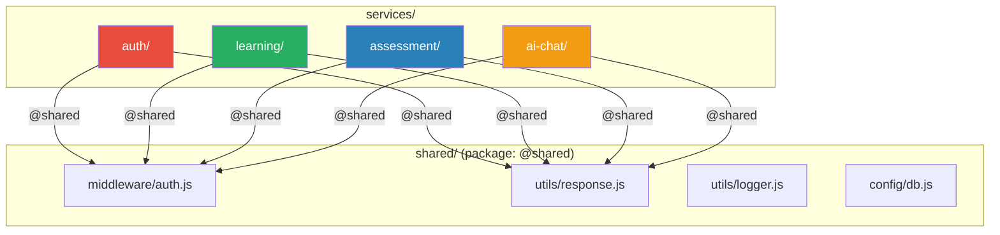

**Cách cài đặt:**

```json
// shared/package.json
{ "name": "@shared", "version": "1.0.0" }

// services/auth/package.json
{ "dependencies": { "@shared": "file:../../shared" } }
```

**Import trong code:**

```js
const authMiddleware = require('@shared/middleware/auth');
const { ok, serverError } = require('@shared/utils/response');
```

> `npm install` sẽ tạo symlink `node_modules/@shared → ../../shared`. NodeJS resolve như package bình thường, không hack runtime.

---

## 14. Migration Strategy (Strangler Pattern)

Chuyển đổi từ Monolith → Microservice theo 6 bước, **không phá vỡ hệ thống hiện có**.

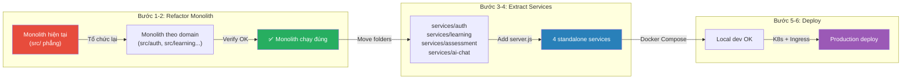

### Chi tiết từng bước

| Bước | Mô tả | Output |
|------|--------|--------|
| **1** | Tổ chức lại `src/` theo domain: `auth/`, `learning/`, `assessment/`, `ai-chat/`, `shared/` | Monolith code gọn hơn |
| **1.5** | Chuẩn hóa interface — controller không import model domain khác, gọi qua service layer | Giảm coupling |
| **2** | Test monolith vẫn chạy đúng | ✅ Không regression |
| **3** | Copy từng domain → `services/` folder, thêm `server.js` + `package.json` | 4 service riêng biệt |
| **4** | Setup `shared/` npm local dependency, mỗi service `npm install` | Shared code hoạt động |
| **5** | Docker Compose chạy 4 services + 1 MongoDB | Local dev full stack |
| **6** | K8s Ingress routing, manifests, deploy | Production ready |

### Quy tắc quan trọng ở Bước 1.5

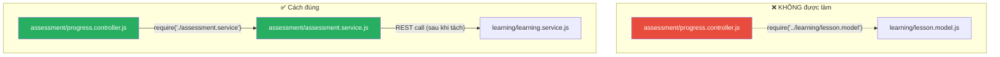

> Trong monolith (bước 1-2): service layer có thể import trực tiếp model domain khác — tạm chấp nhận.
> Khi tách service (bước 3+): thay thế bằng REST call qua internal API.

---
